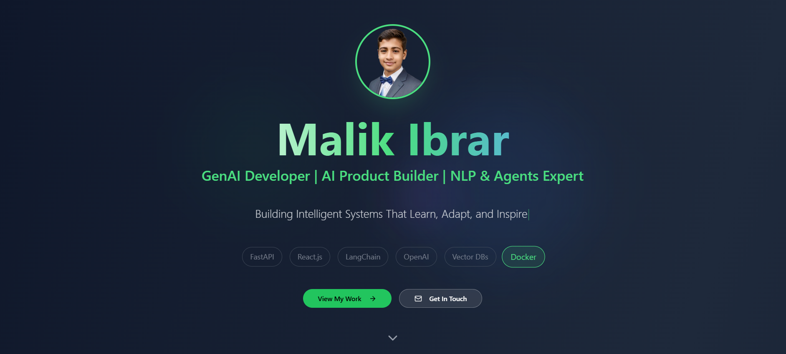

# AI Developer Portfolio – Malik Ibrar

Welcome to my AI Developer Portfolio! This website showcases my work, skills, and experience as a GenAI Developer, AI Product Builder, and NLP & Agents Expert.

## 🚀 About

This portfolio highlights:

- **Featured AI Projects**: Innovative solutions in GenAI, video generation, model fine-tuning, and audio classification.
- **Tech Arsenal**: Modern stack including FastAPI, React.js, Tailwind CSS, OpenAI, Hugging Face, LangChain, Docker, and more.
- **Experience**: My journey in building intelligent systems that learn, adapt, and inspire.
- **Contact & Socials**: Easy ways to connect via email, GitHub, LinkedIn, and Twitter.

## 🖼️ Preview

<p align="center">
  
</p>

## ✨ Features

- Animated hero section with typewriter effect
- Interactive project gallery with image previews
- Modern, responsive UI with Tailwind CSS
- Tech stack and experience sections
- Contact and social links

## 📂 Project Structure

```
src/
  pages/Index.tsx      # Main portfolio page
  components/ui/       # UI components (Button, Card, etc.)
  hooks/               # Custom React hooks
  lib/                 # Utility functions
public/
  image.png            # Portfolio banner image
  ...                  # Other static assets
```

## 🛠️ Tech Stack

- **Frontend**: React.js, TypeScript, Tailwind CSS, Framer Motion
- **Backend**: FastAPI (for AI projects)
- **AI/ML**: OpenAI, Hugging Face, LangChain, CrewAI, FAISS, ChromaDB
- **DevOps**: Docker

## 📦 Getting Started

1. **Install dependencies:**
   ```sh
   npm install
   # or
   bun install
   ```
2. **Run the development server:**
   ```sh
   npm run dev
   # or
   bun run dev
   ```
3. **Open** [http://localhost:8080](http://localhost:8080) in your browser.

## 📬 Contact

- **Email:** malikibrarbhutta@gmail.com
- **GitHub:** [IbrarArif](https://github.com/IbrarArif)
- **LinkedIn:** [malik-ibrar](https://www.linkedin.com/in/malik-ibrar/)
- **Twitter:** [MalikIbrar112](https://twitter.com/MalikIbrar112)

---

<p align="center">
  <b>Building Intelligent Systems That Learn, Adapt, and Inspire</b>
</p>
